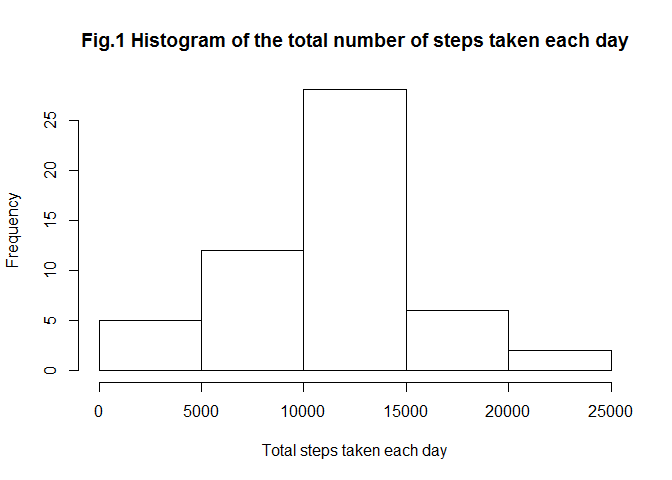
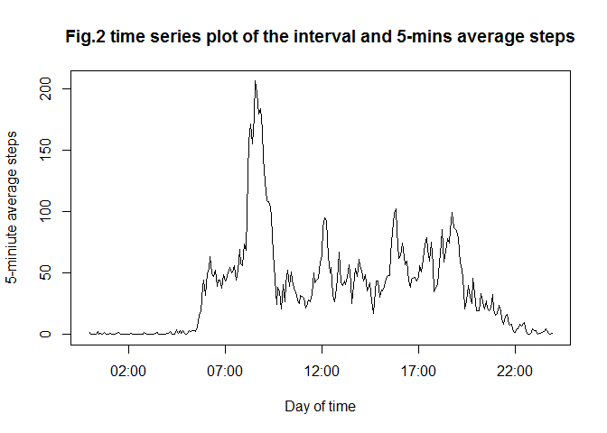
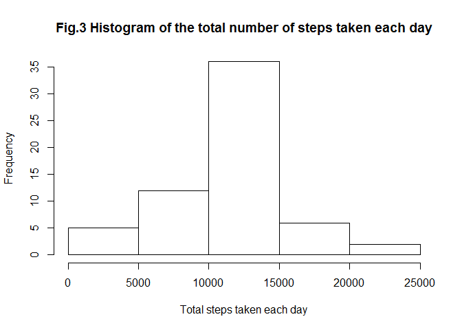
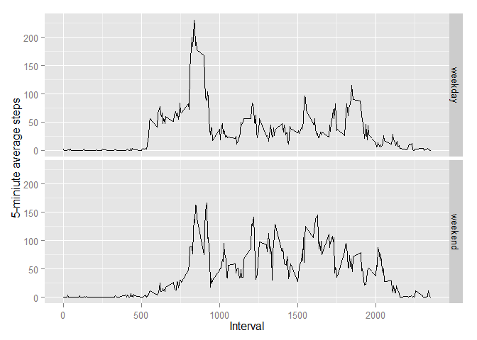

# Reproducible Research: Peer Assessment 1


```r
library(knitr)
library(dplyr)
library(ggplot2)
opts_chunk$set(echo=TRUE)
```

## Loading and preprocessing the data


```r
df<-read.csv(file="D:/0 Coursera/Reproducible Research/activity.csv")
good<-complete.cases(df)
df1<-df[good,]
df2<-df1%>%group_by(date)%>%summarize(total_Steps_per_day=sum(steps))
```

## What is mean total number of steps taken per day?
###1.Calculate the total number of steps taken per day


```r
df2
```

```
## Source: local data frame [53 x 2]
## 
##          date total_Steps_per_day
## 1  2012-10-02                 126
## 2  2012-10-03               11352
## 3  2012-10-04               12116
## 4  2012-10-05               13294
## 5  2012-10-06               15420
## 6  2012-10-07               11015
## 7  2012-10-09               12811
## 8  2012-10-10                9900
## 9  2012-10-11               10304
## 10 2012-10-12               17382
## ..        ...                 ...
```

###2.Make a histogram of the total number of steps taken each day


```r
hist(df2$total_Steps_per_day,xlab="Total steps taken each day",main="Fig.1 Histogram of the total number of steps taken each day")
```

 

###3.Calculate and report the mean and median of the total number of steps taken per day


```r
t_mean<-mean(df2$total_Steps_per_day)
t_median<-median(df2$total_Steps_per_day)
```

Mean of the total number of steps taken per day is 1.0766189\times 10^{4}  
Median of the total number of steps taken per day is 10765

## What is the average daily activity pattern?
###1.Make a time series plot (i.e. type = "l") of the 5-minute interval (x-axis) and the average number of steps taken, averaged across all days (y-axis)


```r
df3<-df1%>%group_by(interval)%>%summarize(avg_Steps_5_mins=mean(steps))
interval1<-(strptime(sprintf("%04d",df3$interval),format="%H%M"))
plot(interval1,df3$avg_Steps_5_mins,type="l",xlab="Day of time",ylab="5-miniute average steps",main="Fig.2 time series plot of the interval and 5-mins average steps")
```

 

###2.Which 5-minute interval, on average across all the days in the dataset, contains the maximum number of steps?


```r
df4<-cbind(df3,interval1)
max_Step<-max(df4$avg_Steps_5_mins)
df5<-filter(df4,avg_Steps_5_mins==max_Step)
max_interval<-df5$interval
max_interval1<-format(df5$interval1,"%H:%M")
```

The maximum number of steps is interval: 835, or time: 08:35

## Imputing missing values
###1.Calculate and report the total number of missing values in the dataset (i.e. the total number of rows with NAs)


```r
total_Missing<-dim(df)[1]-dim(df1)[1]
```

The total number of missing values in the dataset is 2304

###2.Devise a strategy for filling in all of the missing values in the dataset. The strategy does not need to be sophisticated. For example, you could use the mean/median for that day, or the mean for that 5-minute interval, etc.

To fill all of the missing values in the dataset with the mean for that 5-minute interval

###3.Create a new dataset that is equal to the original dataset but with the missing data filled in.


```r
df_New<-df
for (i in 1:17568){ 
  if (is.na(df_New$steps[i])==TRUE){
     interval_a=df_New$interval[i]
     df_New$steps[i]=as.numeric(df3[df3$interval==interval_a,2])     
  }
}
head(df_New)
```

```
##       steps       date interval
## 1 1.7169811 2012-10-01        0
## 2 0.3396226 2012-10-01        5
## 3 0.1320755 2012-10-01       10
## 4 0.1509434 2012-10-01       15
## 5 0.0754717 2012-10-01       20
## 6 2.0943396 2012-10-01       25
```

###4.Make a histogram of the total number of steps taken each day and Calculate and report the mean and median total number of steps taken per day. Do these values differ from the estimates from the first part of the assignment? What is the impact of imputing missing data on the estimates of the total daily number of steps?


```r
df_New2<-df_New%>%group_by(date)%>%summarize(total_Steps_per_day=sum(steps))
hist(df_New2$total_Steps_per_day,xlab="Total steps taken each day",main="Fig.3 Histogram of the total number of steps taken each day")
```

 

```r
t_mean2<-mean(df_New2$total_Steps_per_day)
t_median2<-median(df_New2$total_Steps_per_day)
```

[Imputing missing data] Mean:1.0766189\times 10^{4}    
[Imputing missing data] Median:1.0766189\times 10^{4}  
[Original data] Mean:1.0766189\times 10^{4}  
[Original data] Median:10765  
The mean value is the same as the original one, and the median value is a little different
from the original value. The impact of imputing missing data with the mean for that 5-minute interval is very small. 

## Are there differences in activity patterns between weekdays and weekends?
###1.Create a new factor variable in the dataset with two levels – “weekday” and “weekend” indicating whether a given date is a weekday or weekend day.


```r
Sys.setlocale("LC_TIME","English")
```

```
## [1] "English_United States.1252"
```

```r
df_New3<-df_New%>%mutate(weekday=weekdays(as.POSIXlt(df_New$date)),type=factor(1*(weekday=="Saturday" | weekday=="Sunday"),label=c("weekday","weekend")))
head(df_New3)
```

```
##       steps       date interval weekday    type
## 1 1.7169811 2012-10-01        0  Monday weekday
## 2 0.3396226 2012-10-01        5  Monday weekday
## 3 0.1320755 2012-10-01       10  Monday weekday
## 4 0.1509434 2012-10-01       15  Monday weekday
## 5 0.0754717 2012-10-01       20  Monday weekday
## 6 2.0943396 2012-10-01       25  Monday weekday
```

###2.Make a panel plot containing a time series plot (i.e. type = "l") of the 5-minute interval (x-axis) and the average number of steps taken, averaged across all weekday days or weekend days (y-axis). See the README file in the GitHub repository to see an example of what this plot should look like using simulated data.


```r
df_New4<-df_New3%>%group_by(interval,type)%>%summarize(avg_Steps_5_mins=mean(steps))
qplot(interval,avg_Steps_5_mins,data=df_New4,geom=c("line"),facets=type~.,xlab="Interval",ylab="5-miniute average steps",title="Fig.4 time series plot of the interval and 5-mins of average steps")
```

 
